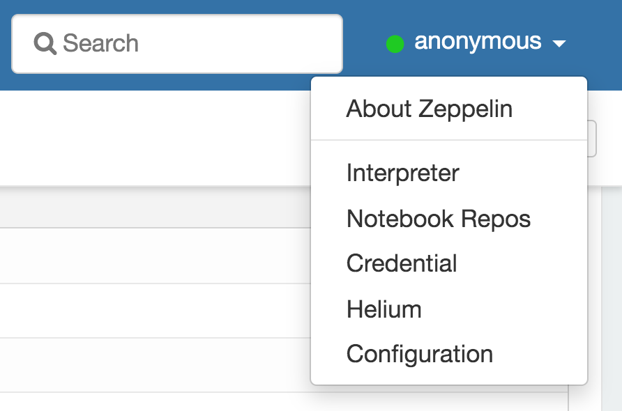
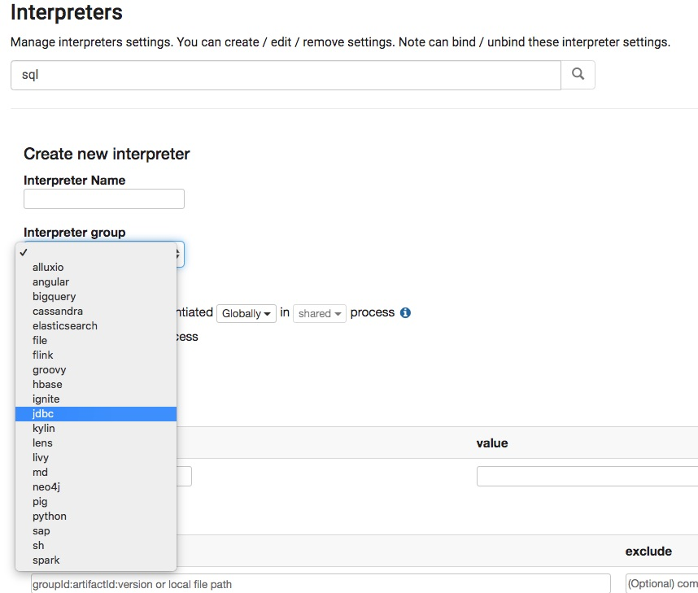
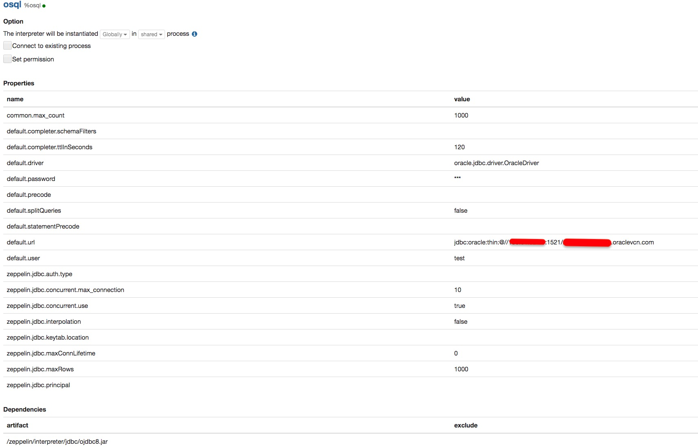

# Predictive Maintenance through MSET-SPRT 
This is a description to setup an environment to test Predictive Maintenance through MSET-SPRT on Oracle DBMS 20c in preview release.  

## Zeppelin setup:
Setup Apache Zeppelin environment for Oracle DB 20c using a docker image.

Install a Docker container in this way::
```
docker run -d -it -e GRANT_SUDO="yes" --user root -p 8080:8080  -v [YOUR_DIRECTORY]:/host  
          --name zeppelin apache/zeppelin:0.8.1
```
Put a copy of **ojdbc8.jar** and save in **/zeppelin/interpreter/jdbc/ojdbc8.jar**

# Create a new interpreter
Connect to http://localhos:8080 and from menu:



push the create button:


and chooe an **Intepreter Name**, for example **osql** , and jdbc as **Interpreter Group**:



then complete as follow:



In this case it has been used a "Service" as DB Connection, non a SID.


